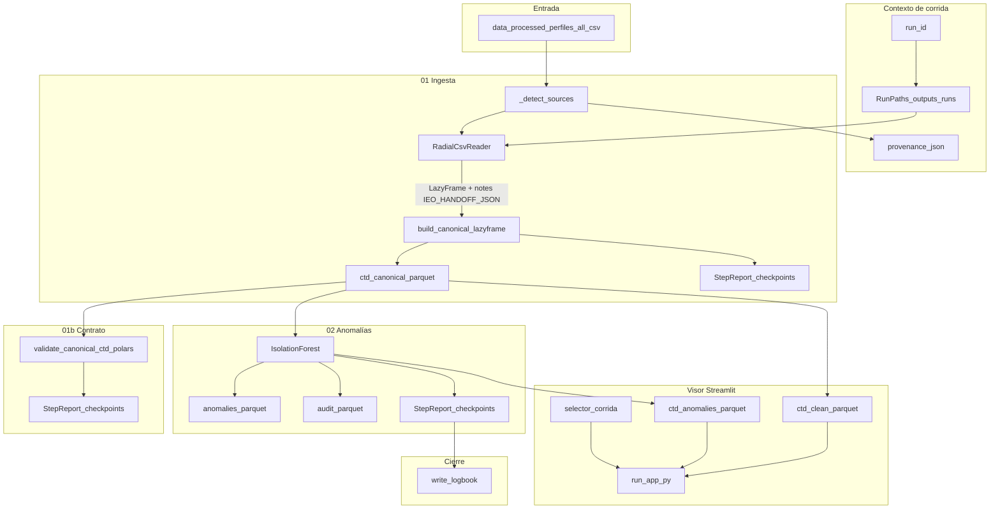

# IEO Orchestrator — Radial Cudillero (pipeline + visor)

[](https://github.com/lobatojorge/IEO-Orchestrator/actions/workflows/ci.yml)

## Qué es esto

Un **sistema de auditoría de datos oceanográficos** con tres componentes:

1. **Pipeline reproducible** (`run/main.py`): ingesta tabular → esquema canónico → contrato de calidad → segregación de anomalías (Isolation Forest) → Parquet versionado con `provenance.json`.
2. **Contrato de datos en código** (`src/ieo/validation/`): reglas con severidad ERROR/WARNING versionadas en git y verificadas en CI — no en un documento PDF.
3. **Visor gobernado** (`run/app.py`): muestra el estado de calidad *antes* de cada gráfica; el investigador ve qué pasó antes de interpretar la serie.

La arquitectura es transferible a otros dominios: datos volcánicos, calidad de agua, cualquier serie temporal de sensor. Ver [`docs/arquitectura_validacion_datos.md`](docs/arquitectura_validacion_datos.md) y [`docs/domain_catalog.md`](docs/domain_catalog.md).

**TRL actual: 4** — demo reproducible con datos CTD reales de la radial de Cudillero. Ver [`docs/posicionamiento_trl.md`](docs/posicionamiento_trl.md) para limitaciones honestas y roadmap.

---

## Demo rápida → [`DEMO.md`](DEMO.md)

Pipeline de ingesta sobre **un CSV tabular** de perfiles CTD y visor **Streamlit** (Marcos + ATAC) para la radial de **Cudillero**. El visor lee los **Parquet** generados por la última corrida del pipeline (o la corrida que elijas en la barra lateral).

---

## Entrada de datos

| Ubicación | Uso |
|-----------|-----|
| `data/processed/perfiles_all.csv` | **Única entrada del pipeline** (`python run/main.py` / `ieo run`). El visor **no** lee este CSV directamente. |
| `outputs/runs/<run_id>/data/*.parquet` | **Entrada del visor** (`streamlit run run/app.py`): `perfiles_all.ctd_clean.parquet` y `perfiles_all.ctd_anomalies.parquet` (y metadatos en `provenance.json` si existen). |
| `data/raw/perfiles_all.csv` | Histórico tabular; conviértelo a processed con **`python run/build_processed_from_raw.py`** (streaming). |
| `data/raw/` (otros) | Crudos (p. ej. `.cnv`); no entran al pipeline hasta convertirlos. |
| `data/cnv/` | Residual; puede quedar vacío o con `.gitkeep`. No es entrada del flujo actual. |

Las carpetas `data/*` (salvo `.gitkeep`) y la mayoría de `outputs/*` están en **`.gitignore`**: no suben al remoto salvo `git add -f`. Antes de `git push`, revisa `git status`.

---

## Arranque rápido

Orden recomendado: **primero** el pipeline (genera Parquet), **después** el visor.

```bash
cd run
pip install -r requirements.txt
python main.py          # pipeline → outputs/runs/<run_id>/
streamlit run app.py    # visor: elige corrida en la barra lateral
```

Desde la raíz: `python run/main.py` · `streamlit run run/app.py`.

**Docker (opcional):** ver [`docs/operacion_tfm.md`](docs/operacion_tfm.md).

---

## Contrato mínimo de una corrida

Tras un `python run/main.py` exitoso, bajo `outputs/runs/<run_id>/` se espera (entre otros):

| Ruta relativa a `run_id` | Rol |
|--------------------------|-----|
| `provenance.json` | Fuentes y parámetros registrados al inicio de la corrida. |
| `data/<stem>.ctd_canonical.parquet` | Tabla canónica CTD (Polars → Parquet). |
| `data/perfiles_all.ctd_clean.parquet` | Filas no marcadas como anomalía por Isolation Forest. |
| `data/perfiles_all.ctd_anomalies.parquet` | Filas anómalas (puede estar vacío). |
| `checkpoints/*.html` | Informes por paso (ingesta, contrato radial, anomalías, calidad). |
| Bitácora bajo `run_root` | Resumen final de la corrida (`write_logbook`). |

El visor exige al menos **`data/perfiles_all.ctd_clean.parquet`**. La caché de Streamlit se invalida si cambia el `mtime`/tamaño de ese fichero.

---

## Flujo de información (pipeline `ieo` + visor)

Los scripts numerados `src/00_*.py` / `01_*.py` son **atajos** hacia el mismo orquestador en muchos casos. El flujo real de producción:



**Streamlit** (`run/app.py`) carga la corrida elegida (o la más reciente), aplica el **contrato radial** sobre perfiles y serie mensual y dibuja **T a 5 m** y **salinidad a 5 m** (estaciones 1–3), con pestaña de revisión **Isolation Forest**. Detalle: `docs/contrato_datos_radiales.md`, metodología: `docs/metodologia_radiales_cudillero.md`.

---

## Estructura relevante

```text
├── data/
│   ├── processed/perfiles_all.csv   # entrada del pipeline (gitignored si contiene datos reales)
│   └── raw/                           # respaldo; no procesado por el visor
├── docs/metodologia_radiales_cudillero.md
├── docs/contrato_datos_radiales.md
├── docs/posicionamiento_trl.md        # TRL 4, limitaciones, roadmap
├── docs/arquitectura_validacion_datos.md
├── docs/guion_reunion_eugenio.md
├── docs/integracion_web_ieo.md
├── docs/operacion_tfm.md              # operación, Docker
├── scripts/e2e_smoke.py               # smoke pipeline + visor
├── src/ieo/                           # pipeline Polars + validación + reportes
├── run/app.py, run/main.py, run/pipeline_runs.py, run/ieo_cli.py
├── tests/                             # pytest (ver requirements-dev.txt)
└── outputs/runs/                      # artefactos por run_id (gitignored)
```

---

## Stack

Python 3.11+, Polars (pipeline), Pandas + Plotly (visor Streamlit), scikit-learn (anomalías Isolation Forest).

**Validación:** contrato de datos propio en `src/ieo/validation/` — dos capas:
- `radial_contract.py` — reglas CTD específicas del Cantábrico (temperatura, salinidad, gradientes verticales, deriva interanual).
- `generic_series_contract.py` — capa 0 transferible: rango absoluto, duplicados, brechas temporales, tendencia extrema. Reutilizable en cualquier dominio.

**Tests:** `pip install -r requirements-dev.txt` → `pytest tests/test_contract.py tests/test_radiales_catalog.py -v`.  
No necesitan datos IEO: usan fixtures sintéticos. El CI (GitHub Actions) ejecuta todos los tests en Ubuntu.

---

## Coherencia pipeline ↔ visor

- **Temperatura (perfil):** el visor usa la misma función que el paso 01b del pipeline: `validate_canonical_ctd_polars` sobre el Parquet limpio (vía Polars). El gradiente vertical usa **dos bandas de Δz** (p. ej. 2,5–5 m vs 5–15 m) con umbrales distintos para no marcar ERROR por glitches casi coplanares ni ignorar termoclinas agudas en varios metros.
- **Salinidad (perfil):** el contrato canónico actual solo formaliza temperatura en ese wrapper; la salinidad sigue validándose con `validate_profile_dataframe` en el visor (misma familia de reglas que el perfil de T).
- **Serie mensual / ATAC:** se valida la serie agregada (`validate_monthly_radial_series`). Marcos+ATAC consume la media mensual interpolada a la profundidad objetivo; **no** inyecta puntuaciones ni explicaciones del `audit_log` de Isolation Forest (coste de ingeniería > beneficio para este alcance; ver `docs/operacion_tfm.md`).
- **Ejecutar pipeline desde el visor:** barra lateral → «Ejecutar pipeline ahora» (subproceso local, sin coste de servicio; puede tardar según tamaño del CSV).

---

## Más detalle

- Uso de la carpeta `run/`: **`run/README.md`**.
- **TRL, limitaciones y roadmap:** [`docs/posicionamiento_trl.md`](docs/posicionamiento_trl.md).
- **Arquitectura de validación (genérica):** [`docs/arquitectura_validacion_datos.md`](docs/arquitectura_validacion_datos.md).
- **Guion reunión / pitch:** [`docs/guion_reunion_eugenio.md`](docs/guion_reunion_eugenio.md).
- Integración web IEO: [`docs/integracion_web_ieo.md`](docs/integracion_web_ieo.md).
- Operación, Docker y marco TRL (TFM): [`docs/operacion_tfm.md`](docs/operacion_tfm.md).
- Smoke test E2E: `python scripts/e2e_smoke.py` (ver `--help`).
- Registro de arranque del visor (apéndices): `outputs/audit/registro_ejecuciones.md` (generado en local; carpeta ignorada en git).
