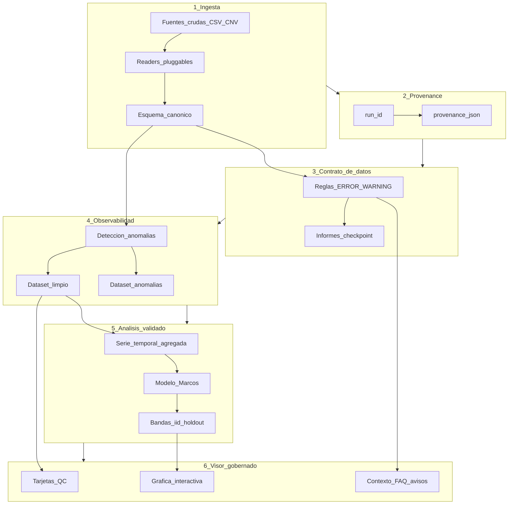

# Arquitectura de validación y auditoría de datos

Patrón genérico implementado en IEO Orchestrator; **demostrado con datos Cantábrico** multi-radial en pipeline (`data/cnv/`) y **visor de demo priorizado en radial Gijón**. Pensado para reutilizarse en otras campañas (p. ej. series temporales en volcanología, sensores ambientales, otros transectos costeros).

---

## Principio

Separar cuatro responsabilidades que suelen mezclarse en un único script o en un dashboard:

1. **Transformar** datos crudos a un esquema canónico.
2. **Validar** contra reglas de dominio (contrato).
3. **Detectar** valores atípicos sin borrarlos (observabilidad).
4. **Analizar y visualizar** solo sobre salidas trazables.

---

## Diagrama de capas



---

## Capas en detalle

### 1. Ingesta canónica

- **Entrada:** archivos heterogéneos (CSV, futuro `.cnv`, Excel legacy).
- **Salida:** tabla con columnas fijas (fecha, estación, profundidad, variables).
- **Código:** `src/ieo/io/`, `src/ieo/transform/canonical_schema.py`, `src/ieo/transform/pipeline.py`.

### 2. Provenance

- Cada ejecución del pipeline genera un `run_id` y metadatos (`provenance.json`).
- Permite reproducir qué fuente y parámetros produjeron cada figura del visor.
- **Código:** `src/ieo/runtime/run_id.py`, `src/ieo/runtime/provenance.py`.

### 3. Contrato de datos

- Reglas declarativas en Python con severidad **ERROR** (bloquea gráfica en visor) y **WARNING** (contexto tras interpretar).
- Incluye comprobación de **rango de años** en la columna canónica `fecha` (metadatos de muestreo plausibles), además de rangos físicos y saltos en perfil/serie mensual.
- No sustituye el juicio científico; formaliza umbrales acordados.
- **Código:** `src/ieo/validation/radial_contract.py` · **Doc:** `docs/contrato_datos_radiales.md`.

### 4. Observabilidad

- Isolation Forest multivariante (columnas numéricas con <40 % NaN) con semilla fija (`random_state=42`).
- `contamination=0.05` en el pipeline (paso 02): se asume hasta un **5 %** de filas atípicas **por estrato** (radial × banda de profundidad). Valor fijo y reproducible; más conservador que el `"auto"` de sklearn (~10 %). Ninguna fila se elimina: las anómalas van a Parquet separado y son trazables.
- Estratificación opcional por `radial_id` y banda de profundidad: cada estrato entrena su propio modelo, evitando que los extremos válidos de una radial sean percibidos como anómalos desde la perspectiva de otra.
- Columnas categóricas codificadas como enteros (`estacion`, `cast`) excluidas de las features.
- Columnas con >40% de NaN excluidas (imputación poco fiable a esa tasa).
- `top_features` guardado solo para filas anómalas (audit más ligero).
- Filas anómalas en Parquet separado; trazables en informes HTML.
- **Código:** `src/ieo/observability/anomaly.py`, paso 02 del pipeline.

### 5. Análisis con validación

- Serie mensual por estación y profundidad objetivo.
- Descomposición Marcos (tendencia + estacionalidad) + bandas **iid** (σ constante, sin AR); holdout explícito (últimos N meses).
- Líneas del visor solo entre meses consecutivos (`ieo/reports/plot_gaps.py`).
- **Código:** `src/02_analysis.py`, `src/atac_monthly_report.py`.

### 6. Visor gobernado

- Consume preferentemente **Parquet limpio de la corrida** filtrando por radial activa (`run/pipeline_runs.py` → `run/app.py`); lectura intensiva desde `.cnv` como respaldo cuando no hay artefactos útiles para esa radial/corrida.
- Capa de presentación («early warning»): hero + embudo narrado de pasos, mapas contextualizados (`viewer_presentation.py`, `figures_radiales.py`).
- Selección de estación mediante **widgets nativos Streamlit** (botones/pestañas) para reducir carga por interacciones redundantes Plotly · mapas Plotly siguen disponibles pero no son el disparador único ni el más pesado.
- FAQs, badges de cobertura/última campaña/fuente, avisos de contrato bajo serie en lenguaje claro cuando aplica.

- **Código:** `run/app.py`.

---

## Interfaz del contrato (desacoplada del visor)

Conceptualmente:

```
entrada: DataFrame | LazyFrame canónico
salida:  list[Violation]  # code, severity, message, details
```

El visor y el pipeline comparten las mismas funciones; Streamlit solo renderiza `Violation` ya formateadas. Esto permite reutilizar el contrato en CLI, tests (`scripts/e2e_smoke.py`) o, en el futuro, otro frontend web.

---

## Catálogo de dominio (plantilla)

`src/ieo/radiales_catalog.py` identifica estaciones y filtra por radial (Cudillero vs Santander, etc.). El mismo patrón sirve para un **catálogo de sensores o estaciones volcánicas**: códigos permitidos, metadatos, reglas de rechazo temprano en ingesta.

---

## Caso demostrado vs producto genérico

| Aspecto | Genérico (arquitectura) | Demo actual (Cantábrico multi-radial) |
|---------|-------------------------|---------------------------------------|
| Esquema canónico | Sí | CTD radial |
| Contrato | Sí | T, S y salinidad vertical, serie mensual con lagunas, series cortas |
| Visor | Sí | T/S @ 5 m, 3 estaciones Gijón (hero) |
| Despliegue | Diseño | Streamlit local / URL demo |

---

## Referencias

- TRL y roadmap: [`posicionamiento_trl.md`](posicionamiento_trl.md)
- Integración web IEO: [`integracion_web_ieo.md`](integracion_web_ieo.md)
