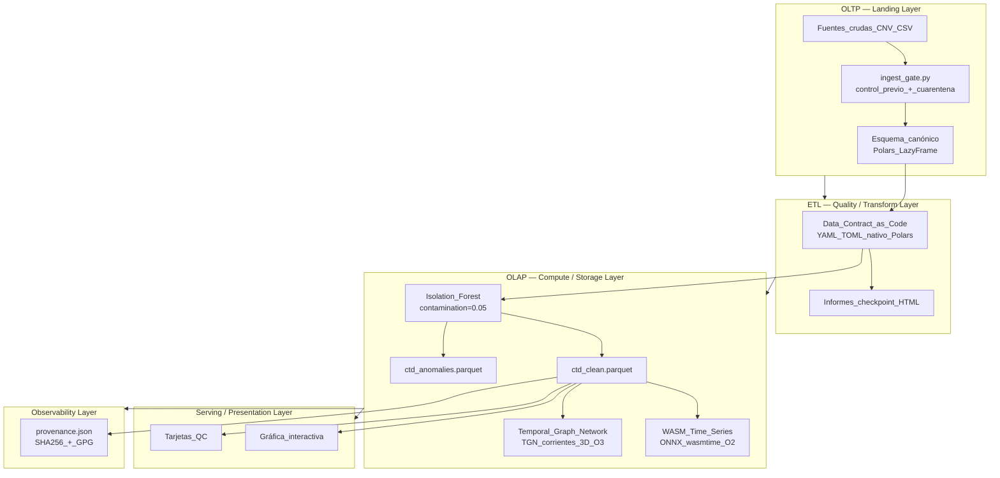

# Arquitectura de Validación y Auditoría de Datos

**Producto software cerrado y auditable.** Implementado en IEO Orchestrator; demostrado sobre datos Cantábrico multi-radial. Diseño transferible a cualquier dominio de series temporales de sensor (volcanología, calidad de agua, transectos costeros).

> **ADR-2026-00 — Producto Cerrado:** toda la cadena de procesamiento opera en capas estrictamente aisladas. Ninguna capa accede directamente al estado interno de otra. La comunicación entre capas se realiza exclusivamente mediante Parquet + Apache Arrow IPC (zero-copy).

---

## Principio Rector: Zero-Copy Lakehouse

El motor central es un **Zero-Copy Lakehouse** basado en Polars + Parquet:

- `scan_parquet` / `LazyFrame` como unidad de transporte entre capas — sin materialización intermedia.
- `Apache Arrow IPC` como protocolo de serialización; elimina toda copia en memoria entre procesos.
- `.to_pandas()` **prohibido** en el path crítico (ver `.ai_rules.md` regla 10). Conversión a Pandas única y explícita en la capa de presentación Streamlit.
- Peak RAM objetivo: **< 512 MB** en full-radial run (O5).

---

## Capas del Sistema (OLTP → ETL → OLAP)

El sistema implementa una **separación estricta en tres capas lógicas** más dos capas auxiliares:

| Capa | Rol | Tipo de carga | Tecnología |
|------|-----|---------------|------------|
| **OLTP — Landing** | Ingesta y cuarentena de ficheros crudos | Escritura transaccional | `ingest_gate.py` + SHA256 + `reasons.json` |
| **ETL — Quality/Transform** | Contratos declarativos + normalización canónica | Transformación por lotes | Polars `LazyFrame` + contratos YAML/TOML (O4) |
| **OLAP — Compute/Storage** | Detección de anomalías + Lakehouse Parquet | Lectura analítica masiva | Isolation Forest → `scan_parquet` zero-copy |
| **Serving** | Presentación interactiva | Lectura filtrada | Streamlit + Plotly (conversión Pandas explícita y aislada) |
| **Observability** | Trazabilidad y auditoría de artefactos | Append-only | `provenance.json` + SHA256 + firma GPG (O6) |

---

## Diagrama de Capas



---

## Capa 1: OLTP — Landing / Ingestion

- **Entrada:** archivos heterogéneos (`.cnv`, CSV, Excel legacy) en `data/landing/`.
- **Control previo:** `ingest_gate.py` verifica estructura CTD antes de tocar el fichero. Rechazo → `data/quarantine/<ts>_fichero + reasons.json`.
- **Salida:** `Polars LazyFrame` con columnas fijas; SHA256 registrado en `provenance.json`.
- **Aislamiento:** esta capa **no ejecuta ninguna regla de negocio**. Solo acepta o rechaza ficheros.

---

## Capa 2: ETL — Quality / Transform (Data Contracts as Code)

- **Contratos declarativos YAML/TOML** ejecutados nativamente en Polars (Objetivo O4). Sustituyen completamente a Great Expectations (ver ADR-2026-01 en `posicionamiento_trl.md`).
- Reglas con severidad **ERROR** y **WARNING**; no modifican datos, producen `list[Violation]`.
- **Código:** `src/ieo/validation/radial_contract.py` + contratos en `src/ieo/validation/contracts/`.
- Interfaz del contrato (desacoplada del visor):

```
entrada: Polars LazyFrame canónico
salida:  list[Violation]  # {code, severity, message, row_index, details}
```

---

## Capa 3: OLAP — Compute / Storage (Zero-Copy Lakehouse)

### Motor actual
- **Isolation Forest** multivariante (`contamination=0.05`, `random_state=42`), estratificado por `radial_id` y banda de profundidad.
- Salida: `ctd_clean.parquet`, `ctd_anomalies.parquet`, `ctd_anomaly_audit.parquet` — leídos siempre vía `scan_parquet` (zero-copy).

### Roadmap TGN / WASM (O2, O3)

| Componente | Estado | Target |
|------------|--------|--------|
| **WASM Time Series** (ONNX → wasmtime) | 🔵 Roadmap O2 | Sustituye TimeGPT; inferencia local offline, p99 < 200 ms |
| **Temporal Graph Network** (PyG `TemporalData`) | 🔵 Roadmap O3 | Modela corrientes oceánicas 3D continuas; supera GNN estático en RMSE |

- Los modelos WASM y TGN operan **sobre `ctd_clean.parquet`** leído en zero-copy; no tienen acceso directo a las capas OLTP/ETL.

---

## Capa 4: Serving / Presentation

- Streamlit filtrando por `radial_id`.
- **Única conversión Pandas permitida:** `LazyFrame.collect().to_pandas()` explícita e inmediatamente antes del render.
- Estado gestionado exclusivamente vía `st.session_state` (`.ai_rules.md` regla 11).
- **Código:** `src/serving/app.py`.

---

## Capa 5: Observability (Trazabilidad y Auditoría)

- `provenance.json`: SHA256 de cada fichero fuente, versión Python, plataforma, parámetros de corrida.
- `run_summary.json`: código de salida, pasos, artefactos, conteo de anomalías.
- Objetivo O6: firma GPG de artefactos + SLSA Level 2 para reproducibilidad bit-a-bit.

---

## Tabla: Caso Demostrado vs Producto Cerrado

| Aspecto | Arquitectura genérica | Demo actual (Cantábrico) | Producto cerrado (O1–O6) |
|---------|----------------------|--------------------------|-----------------------------|
| Orquestación | Micro-agentes tipados | Pipeline secuencial | Micro-agentes compilados (Mypyc) |
| Contrato | Declarativo YAML/TOML | `radial_contract.py` | Contratos YAML/TOML nativos Polars |
| Motor analítico | Zero-Copy Lakehouse | Parquet + Polars | `scan_parquet` + Arrow IPC |
| Modelos | WASM + TGN | Isolation Forest + Marcos | WASM ONNX + TGN (PyG) |
| Auditoría | SHA256 + GPG | `provenance.json` | SLSA Level 2 + RBAC JWT |
| Despliegue | Docker cerrado | Streamlit local | Docker + hash-signing |

---

## Referencias

- TRL y roadmap: [`posicionamiento_trl.md`](posicionamiento_trl.md)
- Integración web IEO: [`integracion_web_ieo.md`](integracion_web_ieo.md)
- Catálogo de dominio: [`domain_catalog.md`](domain_catalog.md)
